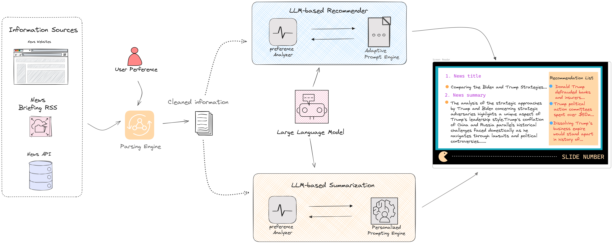
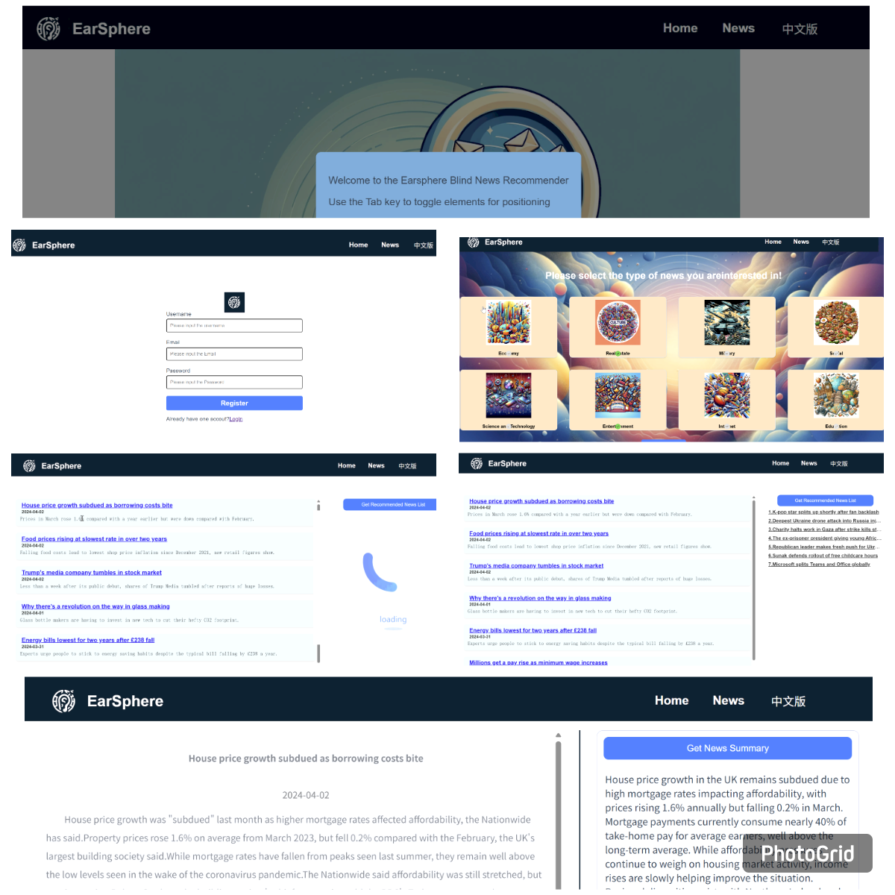

# LLM-Reading Aid-Visually Impaired
This is code implementation for the paper: LLM-Powered Reading Aid for Visually Impaired Online Learners

**First-authored paper** (Springer, AIET 2024) — presented at the conference and awarded Best Session Presenter. The pilot deployment increased daily platform engagement by 40%.


# 🔗 Paper &  Demo Video


- 📄 **Paper (Springer)**: [LLM-Powered Reading Aid for Visually Impaired Online Learners](https://link.springer.com/chapter/10.1007/978-981-97-9255-9_19)
- 🎥 **Demo Video**: [figs/demo_video.mp4](figs/demo_video.mp4) (embedded below)


https://raw.githubusercontent.com/danielwork12121-lab/LLM-Reading-Aid-Visually-Impaired/main/figs/demo_video.mp4


# 📖 Introduction





LLM-ReadingAid-VisuallyImpaired is advanced intelligent reader system aimed at improving online extracurricular reading for visually impaired learners. Our system delivers personalized content recommendations and summaries based on users’ historical interests.

# 🖼️ Screenshots



# 🛠️ Tech Stack

- **Backend**: Flask, Flask-CORS, PyMySQL / mysql-connector-python, LangChain, the OpenAI SDK (pointed at any OpenAI-compatible chat completions endpoint, including Claude via a proxy — see `Setup` below)
- **Frontend**: Vue 3 (Vue CLI), Vue Router, Vuex, Axios
- **Data**: MySQL, RSS feeds (`feedparser`) and web scraping (`selenium`, `parsel`, `beautifulsoup4`) for sourcing daily news

# 🚀 Setup

## Backend (`news_recommender_flask/`)

```bash
cd news_recommender_flask
pip install -r requirements.txt

# 1. Create the MySQL database and tables
mysql -u <your_user> -p < db/init_database.sql

# 2. Configure database + LLM credentials
cp config/config.ini.example config/config.ini
# then edit config/config.ini with your MySQL credentials and your own
# OpenAI-compatible API key/base_url — config.ini is gitignored, so it
# never gets committed

python app.py
```

## Frontend (`news_recommender_vue/`)

```bash
cd news_recommender_vue
npm install
npm run serve
```

> **Note on API keys**: earlier commits in this repo's history contained a
> hardcoded LLM API key. That key has been removed from the current source
> (both files now read from the gitignored `config.ini` above, matching the
> pattern the rest of the codebase already used) and should be treated as
> revoked — do not reuse it.
